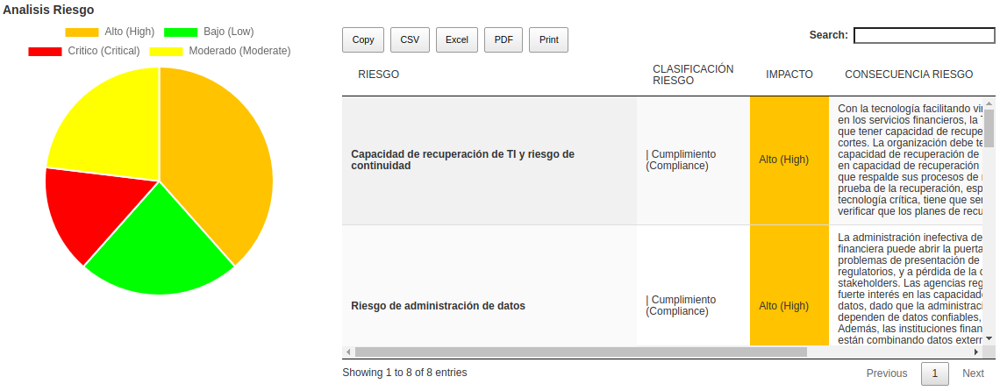
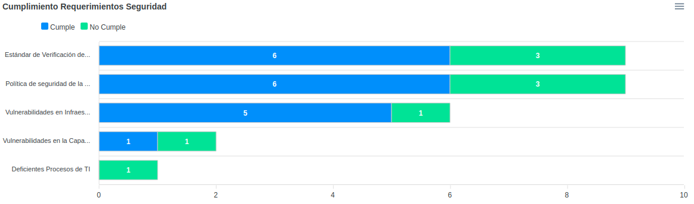
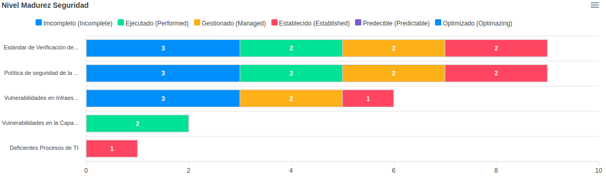
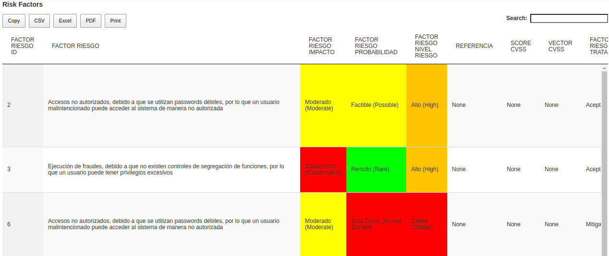

THE PROJECT IS NOW BEING MAINTAINED IN THE OWASP PROJECT REPOSITORY 

https://github.com/OWASP/www-project-it-grc

DEMO: http://dev.grcbit.cloud:8000/demo/

User: admin@email.com

Passwd: Password01

-------
GRCbit - Governance, Risk and Compliance Software (GRC)
Copyright (C) rodolfo.lopez@grcbit.com

GRCbit es un software desarrollado en python/web2py que le ayudará a automatizar y centralizar la gestión de Riesgos TI en su organización (Governance, Risk and Compliance), para tener mayor control sobre sus operaciones, procesos y sistemas críticos. Está basado en mejores prácticas de gestión de riesgos y control interno como COSO, ISO 31000, COBIT, NIST, CVSS3.1, por lo que cualquier empresa sin importar su tipo o tamaño puede utilizarlo, lo cual traerá beneficios como: Cumplir con leyes y regulaciones, reducir fraudes, reducir de errores en la operación, proteger datos críticos y sistemas de información.

GRCbit is software developed in python/web2py that will help you automate and centralize IT Risk management in your organization (Governance, Risk and Compliance), to have greater control over your operations, processes and critical systems. It is based on best practices of risk management and internal control such as COSO, ISO 31000, COBIT, NIST, CVSS3.1, so any company, regardless of its type or size, can use it, which will bring benefits such as: Compliance with laws and regulations, reduce fraud, reduce operational errors, protect critical data and information systems.

